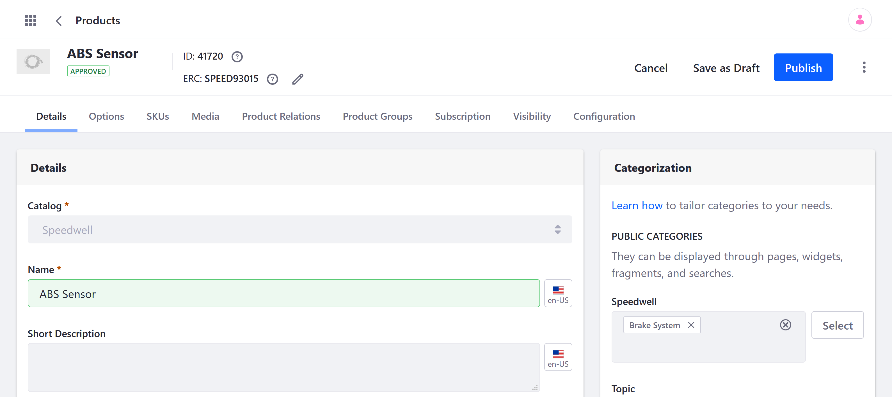
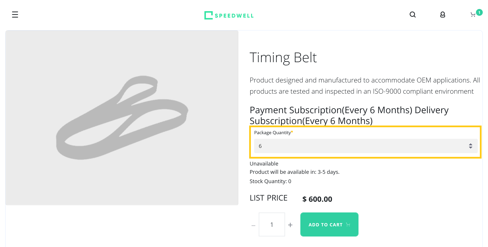

# Products Overview

Liferay Commerce provides three out-of-the-box Product types: [Simple](./creating-a-simple-product.md), [Grouped](./creating-a-grouped-product.md), and [Virtual](./creating-a-virtual-product.md). Each Product type is stored in a [Catalog](../../catalogs/creating-a-new-catalog.md) and assigned a default [SKU](./adding-skus-to-your-products.md) at creation. <!--By default, Products are visible to all Channels and , but you can control Product visibility, determining which Channels or Accounts can view a Product.-->

After creation, you can add each Product can be configured in many of the same ways and have additional SKUs added to it for Product variants.. These configurations determine __, as well as the information displayed in a Product's details page.<!--FINISH-->

For instance, you can upload [images](./product-images.md) and [attachments](./product-attachments.md) directly to a Product. Subscription users can also map Products to a Bill of Materials (BOM) diagram to help customers identify what they need. See [Managing BOMs](./managing-boms.md) for more information.

Easily create friendly URLs for Products and add meta data for search engine optimization (SEO).

Use [Product Categories](./organizing-your-catalog-with-product-categories.md) to group related products and quickly display them together on your Site using widgets and fragments.

Add [specifications](./specifications.md) to your Products, such as dimensions, weight, material, and warranty information.

With [Options](./customizing-your-product-with-product-options.md), you can quickly add custom fields to your Products. These fields can be used to gather customer input (e.g., date, custom message) and provide customers with a choice between Product variants.

Set up subscriptions... Configure custom Product inventory rules to govern how a Product is sold when its inventory falls below a set threshold, the maximum and minimum quantity a user can buy in a single order, and whether the store will take back orders.

## Additional Information

* [Creating a Simple Product](../product-types/creating-a-simple-product.md)
* [Creating a Grouped Product](../product-types/creating-a-grouped-product.md)
* [Creating a Virtual Product](../product-types/creating-a-virtual-product.md)
