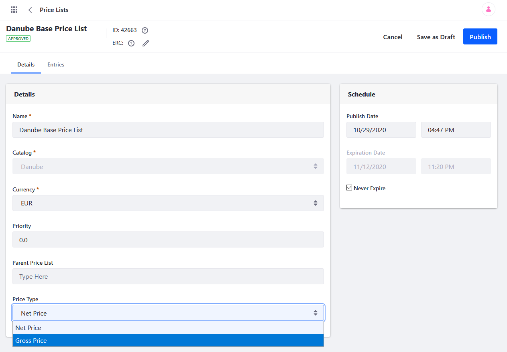

# Using Gross and Net Price Types

With Liferay Commerce, you can use either the Gross or Net price type for calculating promotions and [discounts](../../promoting-products/introduction-to-discounts.md). This setting is configured for [Price Lists](../managing-price/creating-a-price-list.md) and [Channels](../../starting-a-store/channels/introduction-to-channels.md).

## Setting the Price List's Price Type

Follow these steps to set the price type for a Price List:

1. Open the *Global Menu* (), click on the *Commerce* tab, and go to *Price Lists*.

1. Click on the Price List you want to configure.

1. In the *Details* tab, use the *Price Type* drop-down menu to select either *Net Price* or *Gross Price*.

    

1. Click on *Publish* when finished.

Your selected price type will now be used as the basis for calculating promotions and discounts for this Price List.

## Setting Price Type in a Channel

You can also set the price type for a Channel. To do so, follow these step:

1. Open the *Global Menu* (), click on the *Commerce* tab, and go to *Channels*.

1. Click on the desired Channel.

1. In the *Prices* section of the *General* tab, use the *Price Type* and *Discounts Target Price Type* drop-down menus to select either *Net Price* or *Gross Price*.

1. Click on *Save* when finished.

    

## Understanding Gross and Net Price Calculations

If a Price List or promotion contains gross price entries, Commerce calculates the net price by subtracting the taxes from the gross price. The net price is then used to calculate the unit and promo price. Other price modifiers are then applied. The best net price between unit and promo is selected, and the discount (with target product, product groups, categories) is applied.

If the discount amount is gross, then the net amount is calculated and applied to the net price of the product. When a discount is a *fixed amount*, the taxes are removed from the discount amount before applying the discount calculation algorithm. When discount is a *percentage amount*, the net percentage is recalculated before applying the discount: N = L - T(100-L) with T in %. Taxes are calculated on the final price.

The order details page contains the following information for each order item:

* SKU
* Name
* Price (net)
* Price (gross)
* Discount (net or gross)
* Discount (gross)
* Quantity
* Total (net)
* Total (gross)

When the unit, promo and final prices are shown in the channel, the system adds net and tax in case the channel is configured to show gross prices.

## Additional Information

* [Introduction to Discounts](../../promoting-products/introduction-to-discounts.md)
* [Creating a Price List](./creating-a-price-list.md)
* [Managing Channels](../../starting-a-store/channels/managing-channels.md)
