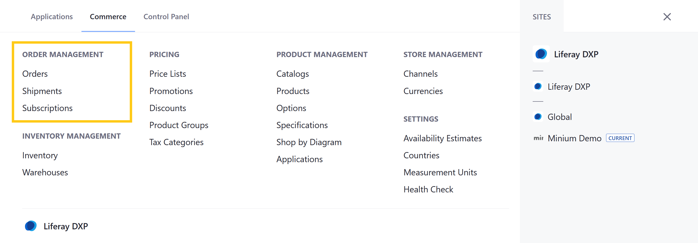
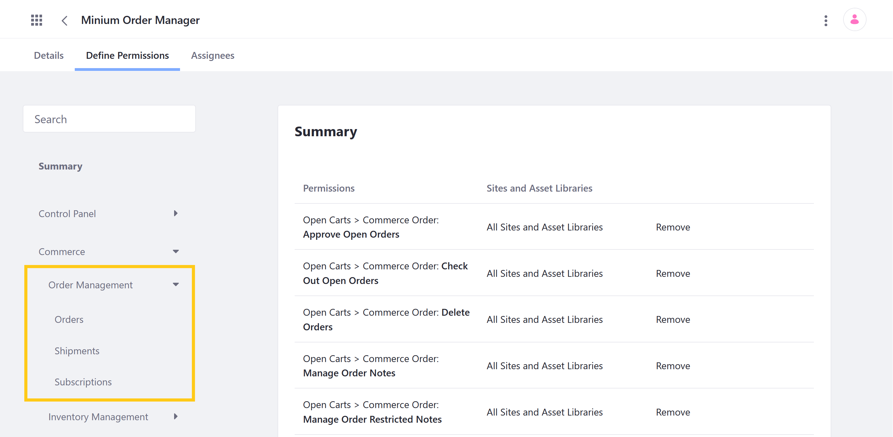

# Order Management Permissions Reference Guide

Liferay Commerce provides out-of-the-box permissions to control access to Order Management applications and resources in the Global Menu ().



You can manage Order Management permissions for user roles under *Commerce* &rarr; *Order Management* in the Define Permissions tab. Assign permissions individually, or check *Action* to assign all permissions for an application or resource.



```note::
   The following article does not document permissions for related widgets.
```

## Standard Application Permissions

Application permissions define what actions can be performed in an application.

Order Management includes the following applications:

* **Orders**: This application is used to view and manage orders across a Liferay instance.

* **Shipments**: This application is used for viewing and managing Shipments generated for Orders across a Liferay instance.

* **Subscriptions**: This application is used for viewing and managing both active and inactive customer Subscriptions across a Liferay instance.

All Order Management applications have the following permissions:

| Permission | Description |
| --- | --- |
| Access in Control Panel | Ability to access the application in the Global Menu |
| Configuration | Ability to view and set the application's configuration options |
| Permissions | Ability to view and modify the application's permissions |
| Preferences | Ability to view and set application preferences |
| View | Ability to view ... | <!--finish-->

## Related Resource Permissions

Resource permissions define what actions can be performed on resources displayed or managed within an application. Resources are any user-facing object, such as Catalogs, Price Lists, Orders, and Warehouses.

Order Management applications reference<!--w/c--> the following resources:

* **Commerce Order** (listed under Orders): Orders are created when customers purchase Products in a Channel and are used to store and process order information. Each Order entity includes customer information (i.e., account, billing, shipping), as well as all other order details (e.g., included items, order total, date, notes, acceptance workflow status, etc.). See [Processing an Order](../../orders-and-fulfillment/orders/processing-an-order.md) for more information. <!--FINISH-->

| Permission | Description |
|---|---|
| Add Order | Ability to add an order |
| Approve Open Orders | Ability to approve orders if workflow has been enabled |
| Check Out Open Orders | Ability to complete the checkout process for new, incomplete orders |
| Delete Orders | Ability to delete orders |
| Manage Order Notes | Ability to add a note to an order | <!--ALL notes? Does this include restricted notes? I assume not, given the following permission.-->
| Manage Order Restricted Notes | Ability to access restricted notes for an order |
| Manage Orders | Ability to change order details (e.g., mailing and billing addresses) |
| Permissions | Ability to view and manage permissions for each Commerce order |
| View Open Orders | Ability to view all open orders |
| View Orders | Ability to view all orders, regardless of status |

* **Commerce Warehouse** (listed under Shipments, [Warehouses](./inventory-management-permissions-reference-guide.md), and [Products](./product-management-permissions-reference-guide.md)): Warehouses are entities for storing Product inventory. Each Warehouse is connected to Channels and represents a physical location, with an address and geolocation. See [Adding a New Warehouse](../../managing-a-catalog/managing-inventory/adding-a-new-warehouse.md) for more information.

| Permission | Description |
|---|---|
| Delete | Ability to delete any existing Warehouse |
| Permissions | Ability to view and modify permissions for any Warehouse |
| Update | Ability to edit and modify any Warehouse |
| View | Ability to view all Warehouses |

## Additional Information

* [Processing an Order](../../orders-and-fulfillment/orders/processing-an-order.md)
* [Adding a New Warehouse](../../managing-a-catalog/managing-inventory/adding-a-new-warehouse.md)
