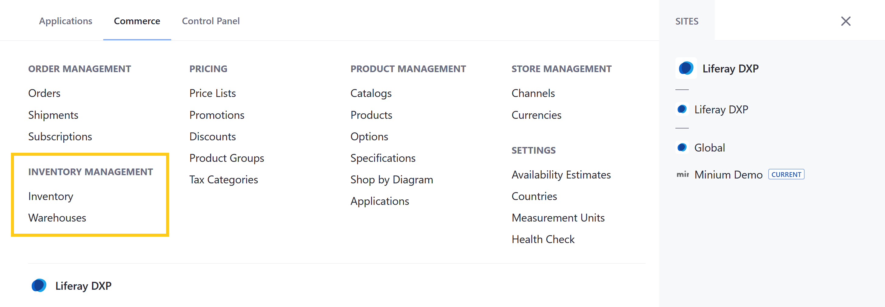
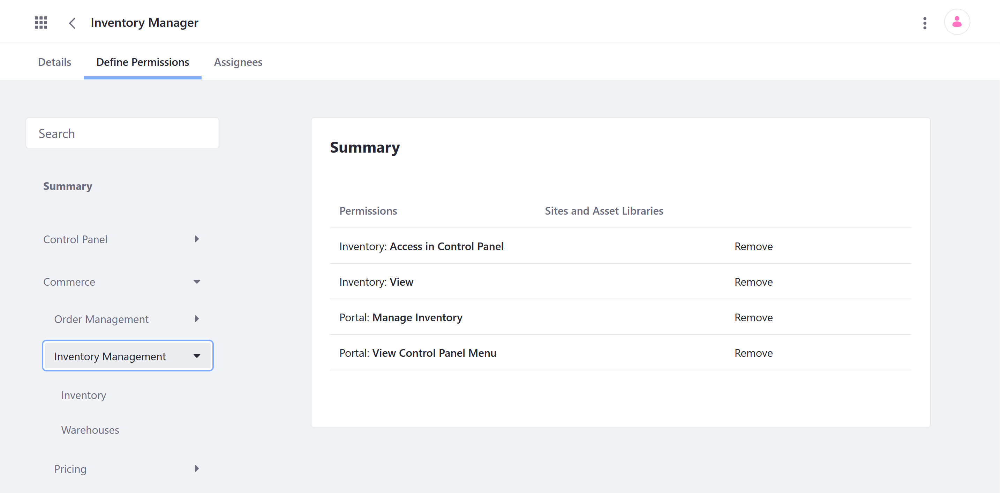

# Inventory Management Permissions Reference

Liferay Commerce provides out-of-the-box permissions to control access to Inventory Management applications and resources in the Global Menu ().



You can manage Inventory Management permissions for user roles under *Commerce* &rarr; *Store Management* in the Define Permissions tab. Assign permissions individually, or check *Action* to assign all permissions for an application or resource.



```note::
   The following article does not document permissions for related widgets.
```

## Standard Application Permissions

Application permissions define what actions can be performed in an application.

Inventory Management includes the following applications:

**Inventory**: This application is used to create and manage inventory entries for Product SKUs. See [Inventory Management Reference Guide](../../managing-a-catalog/managing-inventory/inventory-management-reference-guide.md) for more information.

**Warehouses**: This application is used to create Warehouse entities that store Product inventory. See [Warehouse Reference Guide](../../managing-a-catalog/managing-inventory/warehouse-reference-guide.md) for more information.

All Inventory Management applications have the following permissions:

| Permission | Description |
| --- | --- |
| Access in Control Panel | Ability to access the application in the Global Menu |
| Configuration | Ability to view and set the application's configuration options |
| Permissions | Ability to view and modify the application's permissions |
| Preferences | Ability to view and set application preferences |
| View | Ability to view the application |

## Related Resource Permissions

Resource permissions define what actions can be performed on resources displayed or managed within an application. Resources are any user-facing object, such as Catalogs, Price Lists, Orders, and Warehouses.

Inventory Management applications reference the following resources:

**Commerce Warehouse** (listed under Warehouses, [Shipments](./order-management-permissions-reference.md), and [Products](./product-management-permissions-reference.md)): Warehouses are entities for storing Product inventory. Each Warehouse is connected to Channels and represents a physical location, with an address and geolocation. See [Adding a New Warehouse](../../managing-a-catalog/managing-inventory/adding-a-new-warehouse.md) for more information.

| Permission | Description |
|---|---|
| Delete | Ability to delete any existing Warehouse |
| Permissions | Ability to view and modify permissions for any Warehouse |
| Update | Ability to edit and modify any Warehouse |
| View | Ability to view all Warehouses |

**Commerce Inventories** (listed under Warehouses): <!-- FINISH -->

| Permission | Description |
|---|---|
| Add Warehouse | <!-- FINISH --> |
| Manage Inventory | <!-- FINISH --> |
| Permissions | <!-- FINISH --> |

## Additional Information

* [Introduction to Managing Inventory](../../managing-a-catalog/managing-inventory/introduction-to-managing-inventory.md)
* [Inventory Management Reference Guide](../../managing-a-catalog/managing-inventory/inventory-management-reference-guide.md)
* [Warehouse Reference Guide](../../managing-a-catalog/managing-inventory/warehouse-reference-guide.md)
