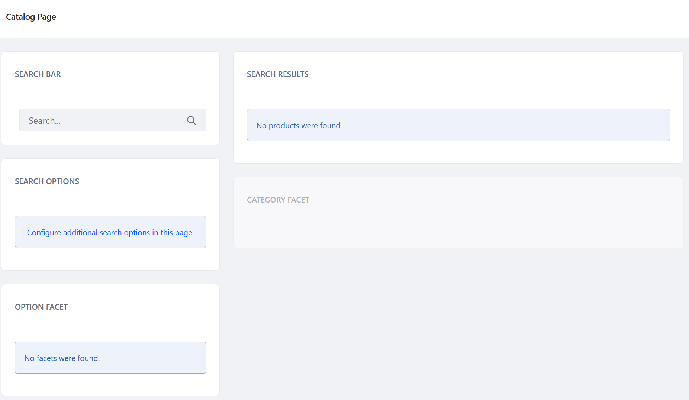
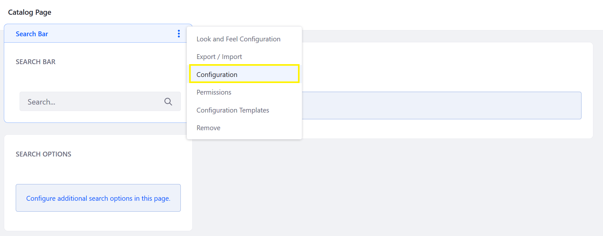
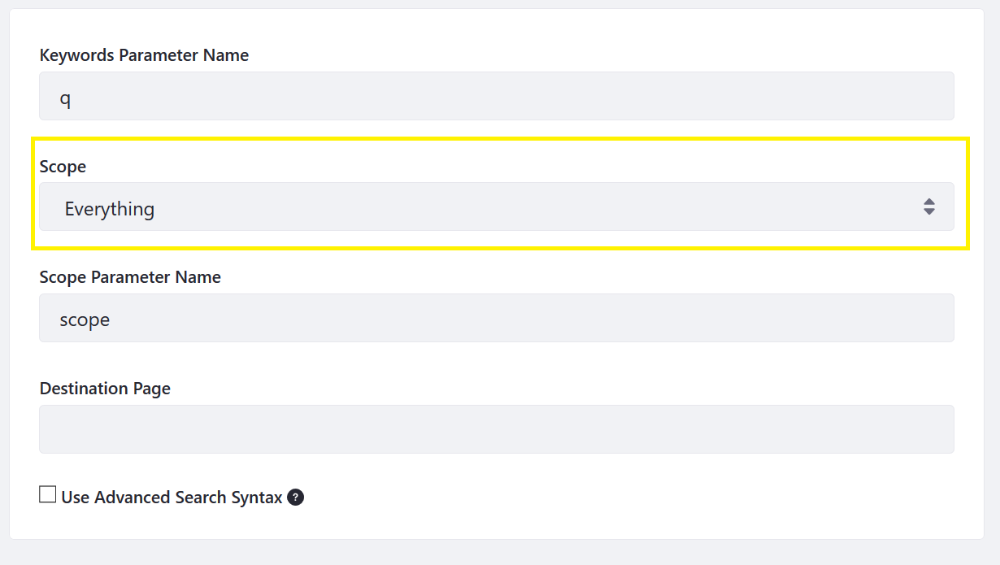
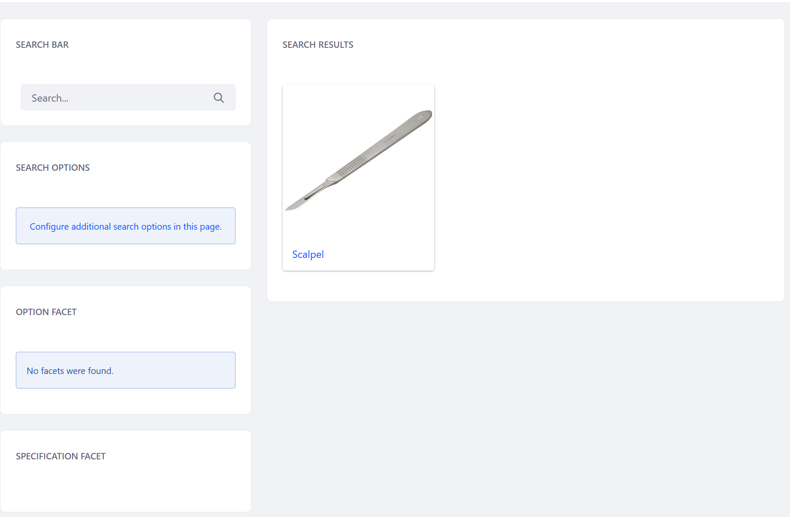

# Creating a Catalog Page

The [Catalog](./commerce-storefront-pages/catalog.md) page is the primary entry point for users to browse products that are being offered in a store. It includes the following widgets: _Search Bar_, _Options Facets_, _Specification Facet_, _Category Facet_ and _Search Results_. To learn more about Commerce widgets see the [Widget Reference](./liferay-commerce-widgets/widget-reference.md).

This article documents an example of how to build a Catalog page without the use of an [accelerator](../starting-a-store/accelerators.md).

## Prerequisites

See the following links to learn more about Site and Page Creation:

* [Creating Page Fragments](https://help.liferay.com/hc/en-us/articles/360018171331-Creating-Page-Fragments)
* [Building Content Pages from Fragments](https://help.liferay.com/hc/en-us/articles/360018171351-Building-Content-Pages-from-Fragments-)
* [Creating and Managing Navigation Menus](https://help.liferay.com/hc/en-us/articles/360018171531-Creating-and-Managing-Navigation-Menus)
* [Using Application Display Templates](https://help.liferay.com/hc/en-us/articles/360017892632-Styling-Widgets-with-Application-Display-Templates)

## Add and Configure the Page

1. Create a Page using the _Widget_ template.
1. The _30-70 Column_ Layout is the default selection. This layout has a narrower left column for the widgets that refine the search and a wider right column for the _Search Results_ widget. Storefront designers can choose different layouts for a different style.

## Add the Widgets to the Page

1. Drag and drop the widgets into the desired positions.
1. Click the _3-dot icon_ then _Look and Feel Configurations_ to add or remove the widget titles.

After creating and configuring the page with the widgets, a basic Catalog page might look like this:

## Configure the _Search Bar_ Widget

The _Search Bar_ widget must be configured to display data from the Global site scope. This is because all products are stored at the global level and not the site level.

1. Click the _3-dot icon_ then _Configuration_ on the _Search Bar_ widget.

    

1. Select _Everything_ from the _Scope_ drop down menu.

    

1. Click _Save_.
1. Close the _Configuration_ window.

The _Search Bar_ widget is now configured to display the content from the entire instance.

## Displaying the Full Catalog Without a Search (Optional)

Liferay Commerce allows store managers to display all the products in a catalog in the _Search Results_ widget without having buyers first enter a search query. This is done by configuring the _Search Options_ widget.

1. Click the _Configure additional search options in this page_ in the _Search Options_ widget.
1. Check the checkbox for _Allow Empty Searches_.
1. Click _Save_.
1. Close the _Configuration_ window.

Once this option has been enabled, all the products in this catalog are displayed in the _Search Results_ widget.

## Configure Product Channel Filters (Optional)

If there is more than one store site that is housed on the Liferay Commerce instance, the entire catalog becomes searchable on every store site.

To scope product to specific sites, see [Configuring Product Visibility Using Channels](../starting-a-store/channels/configuring-product-visibility-using-channels.md).
