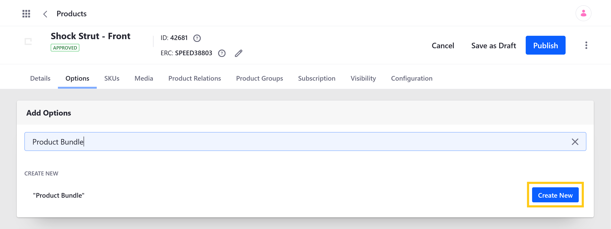
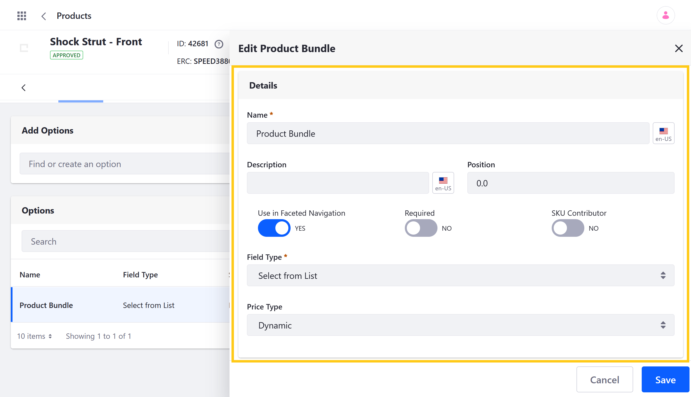
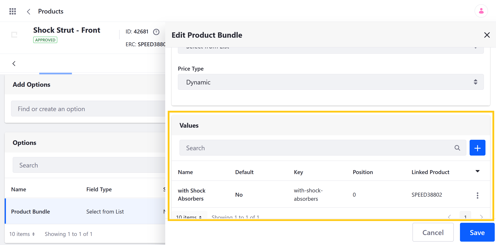
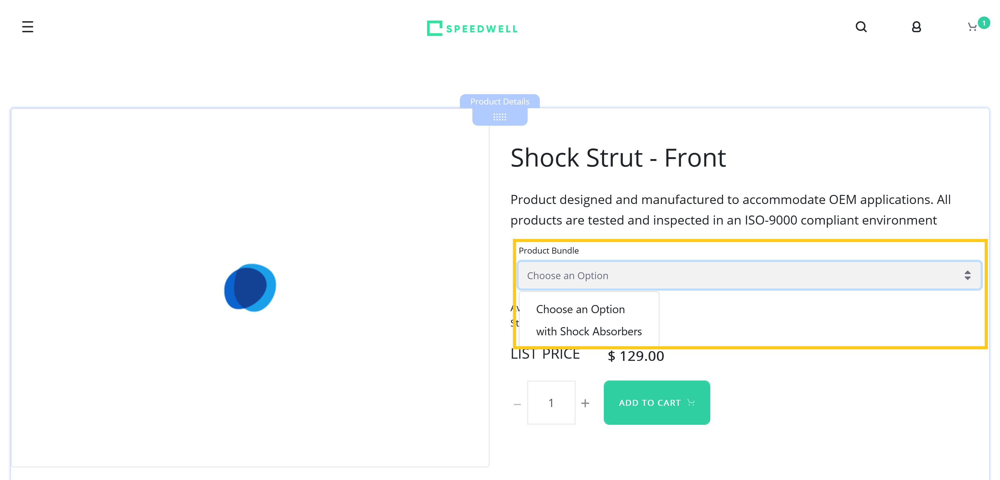

# Creating Product Bundles

With Liferay Commerce, you can create *Product bundles* using [Product Options](./customizing-your-product-with-product-options.md). Bundles are combinations of goods or services that customers can purchase together as a single package.

For example, consider a computer hardware distributor. Customers can select a specific computer model with a standard case, energy supply, motherboard, and OS system, but they must choose between other hardware components (e.g., CPU, GPU, RAM, storage). Each Product variant has its own price based on the selected components. The total cost is calculated by adding the price of the selected value to the Product's base price.

<!--TASK: Insert admonition delineating the difference between Grouped Products and Product bundles.-->

Follow these steps to create a Product bundle:

1. Open the *Global Menu*, click on the *Commerce* tab, and go to *Product Management* &rarr; *Products*.

1. Click on the *Product* you want to use for the bundle's base Product, and go to the *Options* tab.

1. In the *Add Options* field, enter a *name* for your new bundle Option, and click on *Create New*.

   A new Option template is created and applied to your Product using the default Option settings.

   ```tip::
      Alternatively, you can create an Option Template via the *Options* page in the Commerce tab of the Global Menu. This method is best for commonly used types of bundles. See `Customizing Your Product with Product Options <./customizing-your-product-with-product-options.md>`_ for more information.
   ```

   

1. Click on the new *Option* to edit its details and values.

1. Configure the following Option settings:

   * **Description** (Optional): Add a localized *description*.
   * **Position**: Set the Option's priority to determine the order in which it's displayed relative to other Options.
   * **Use in Faceted Navigation**: Determine whether the Option can be used to filter Product search results.
   * **Required**: Determine whether users must select an Option value before adding the Product to the cart.
   * **SKU Contributor**: Determine whether the Option's values are used to generate unique Product SKUs.
   * **Field Type**: Choose the type of field used for the Option.
   * **Price Type**: Choose whether to use *Static* or *Dynamic* pricing for Option values.

      ```note::
         *Dynamic* uses the link SKU's price for a value, while *Static* uses a fixed price set directly in the value. Dynamic and Static prices are added to the Product's base price.

         Also, since Product Bundles use the *Price Type* attribute, they can only use the *Single Selection* and *Select from List* field types.
      ```

   

1. Scroll down to Values, click the *Add* button (), and enter the following details for your value:

   * **Name**: Set the display name used for the value. If SKU Contributor is enabled, this name is used for the value's SKU.
   * **Position**: Set the value's priority to determine its placement in the Option's field.
   * **Key**: This field is auto-generated to match the Name field, though you can set it independently.

   Repeat this process until you've added all the desired values.

   

1. Once created, click on a value to access these additional settings:

   * **Default**: Determine whether the Option defaults to the selected value.
   * **Delta Price** (For Static Only): Set a specific price for the value.
   * **Product**: Link an existing SKU to the value and specify its quantity.

   ```important::
      Each of the Option's values must be unique. This means the same Product+quantity combination cannot be used for multiple values in the same Option. However, the same value can be used in other Options added to the Product.

      Also bundle values cannot link to other Product bundles, to Products with a *required* option, or to Products with *subscription* enabled. If the bundle uses *dynamic* pricing, it can only link to *APPROVED* Product instances.
   ```

1. (Optional) If SKU Contributor is enabled for your Option, go to the *SKUs* tab in the Product's Page, click the Add Button, and select *Generate All SKU Combinations*.

   This generates a new SKU for each Option value, which you can edit in the SKUs tab.

   ```important::
      When enabled, customers *must* select a value, even if Required is not enabled for the Option.
   ```

1. Verify your Product bundle appears in the Product's Display Page.  



## Additional Information

* [Customizing Your Product with Product Options](./customizing-your-product-with-product-options.md)
