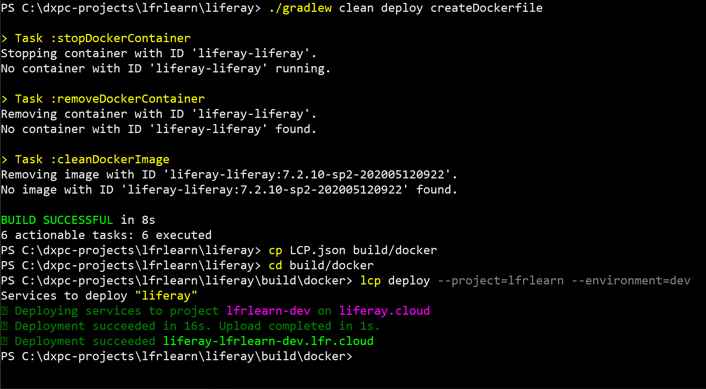
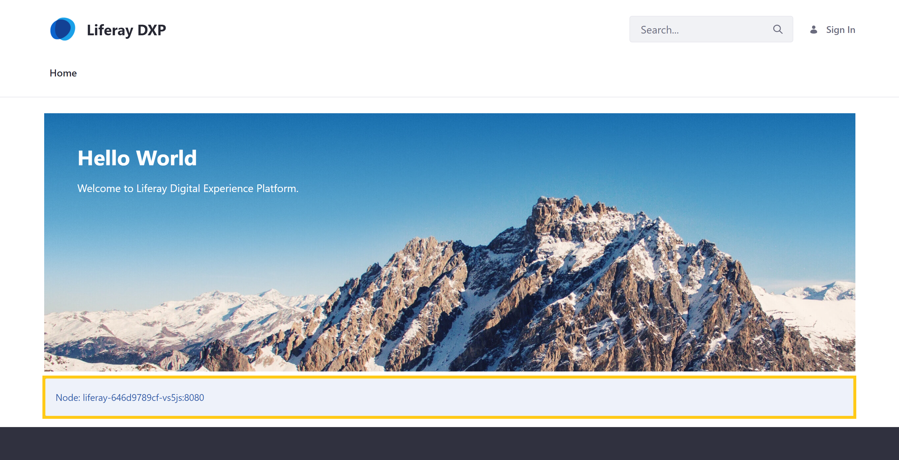

# Deploying Changes via the CLI Tool

With the CLI tool, you can directly deploy local project changes without triggering a Jenkins build or using the DXP Cloud Management Console. This tutorial walks through the process of adding a portal property to the Liferay service and deploying it to the `dev` using the CLI tool.

To get started, you first need the [CLI tool](../reference/command-line-tool.md) installed and ready to use, as well as a local copy of your project's Git repository (e.g., [GitHub](https://docs.github.com/en/github/creating-cloning-and-archiving-repositories/cloning-a-repository-from-github), [Bitbucket](https://confluence.atlassian.com/bitbucketserver/clone-a-repository-790632786.html), [GitLab](https://docs.gitlab.com/ee/university/training/topics/getting_started.html#instantiate-workflow-with-clone)).

```note::
   Although the CLI tool provides a quick way to deploy changes to your project, it's best practice to use the CI service and DXP Cloud console for the majority of deployments. See `Deploying Changes via the DXP Cloud Console <./deploying-changes-via-the-dxp-cloud-console.md>`__ to learn how.
```

If you are using version 3.x.x services in your project, you must first [prepare](#preparing-lcpjson-files-in-project-version-3) their `LCP.json` files before deploying changes with the CLI tool.

Otherwise, you can skip this step and begin the deployment process:

* [Adding a Portal Property to the Liferay Service](#adding-a-portal-property-to-the-liferay-service)
* [Deploying Your New Build via the CLI Tool](#deploying-your-new-build-via-the-cli-tool)
* [Verifying Your Sample Deployment](#verifying-your-sample-deployment)

## Preparing LCP.json Files in Project Version 3

Open the `gradle.properties` at the root of your repository, and find properties for the Docker image versions for each of your services, like the following:

```properties
liferay.workspace.lcp.backup.image=liferaycloud/backup:3.2.1
liferay.workspace.lcp.database.image=liferaycloud/database:3.2.1
liferay.workspace.lcp.search.image=liferaycloud/elasticsearch:6.1.4-3.0.3
liferay.workspace.lcp.liferay.image=liferaycloud/liferay-dxp:7.2.10-ga1-3.0.10
liferay.workspace.lcp.webserver.image=liferaycloud/nginx:1.14.2-3.1.1
liferay.workspace.lcp.jenkins.image=liferaycloud/jenkins:2.176.1-3.1.1
```

For each of these properties, copy the value and use it to replace the placeholder value for the `image` property in the corresponding service's `LCP.json` file. This allows the CLI to use the correct Docker images when it searches within the `lcp` directory.

For example, use the value from the `liferay.workspace.lcp.search.image` property as the new value in `lcp/search/LCP.json` for this line:

```properties
"image": "@liferay.workspace.lcp.search.image@",
```

```note::
   The ``liferay.workspace.lcp.jenkins.image`` property corresponds to the ``ci`` service.
```

## Adding a Portal Property to the Liferay Service

Begin the deployment life cycle by adding a portal property to the `dev` environment's Liferay service and committing your changes:

1. Ensure your local master branch is up-to-date with the latest version of your project's repository.

1. Create a new working branch based on your up-to-date master branch.

   ```bash
   git checkout -b example-cli-deployment-branch
   ```

1. Go to `<project>\liferay\configs\dev\`, and add the following property to the `portal-env.properties` file:

   ```properties
   web.server.display.node=true
   ```

```note::
   If you're using version 3.x.x services, then the appropriate folder path is ``lcp/liferay/deploy/dev``. See `DXP Cloud Project Changes in Version 4 <#project-version-3-differences>`__ for more information on the differences in the directory structure, and `Understanding Service Stack Versions <../reference/understanding-service-stack-versions.md>`__ for how to check the version of your services.
```

1. Add and commit your changes with the following commands:

   ```bash
   git add .
   ```

   ```bash
   git commit -m "Test - Adding Portal Property"
   ```

## Deploying Your New Build via the CLI Tool

Once you've committed your changes, follow these steps to create a build of your Liferay service with Gradle, and then deploy it to your `dev` environment using the CLI tool:

1. Open your terminal, and navigate to the Liferay service folder.

   ```bash
   cd <project-folder>/liferay
   ```

   ```important::
   If you're using version 3.x.x services, you must navigate to the ``lcp`` directory in your repository before running the CLI tool, so that it can traverse the directory and find your services' ``LCP.json`` files.
   ```

1. Run `lcp login`. If you're not already logged in, you are prompted to authenticate your credentials via browser.

1. Run the following commands in sequence to create a Gradle build for your Liferay service:

   ```bash
   ./gradlew clean deploy createDockerfile
   ```

   ```bash
   cp LCP.json build/docker
   ```

   ```bash
   cd build/docker
   ```

   ```important::
      You must first create a Gradle build of the Liferay service before running the ``lcp deploy`` command. No local build process is required for other services, so you can directly deploy backup, CI, database, search, and webserver services.
   ```

1. Run the following command to deploy the build to your `dev` environment:

   ```bash
   lcp deploy --project=<project-name> --environment=dev
   ```

   

   During this process, your new build is added to your project and deployed to the `dev` environment. At this time, the Liferay service should restart with the new portal property.

## Verifying Your Sample Deployment

Once your build has successfully deployed and your `dev` environment's Liferay service is *Ready*, follow these steps to verify your changes:

1. Navigate to your project's `dev` environment.

1. Go to the *Web Server* service's page, and click on its URL to access the `dev` environment's DXP instance: `https://webserver-<project-name>-dev.lfr.cloud/`.

   

1. Verify the web server node is displayed at the bottom of the Home Page.

   

## Additional Information

* [Command-Line Tool](../reference/command-line-tool.md)
* [Overview of the DXP Cloud Development Workflow](./overview-of-the-dxp-cloud-deployment-workflow.md)
* [Deploying Changes via the DXP Cloud Console](./deploying-changes-via-the-dxp-cloud-console.md)
