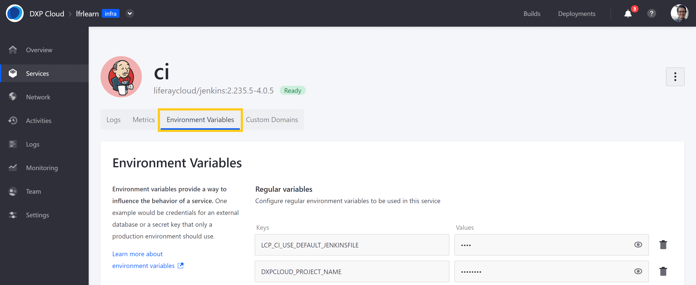

# Setting Up Automatic Deployment

Once integrated with the CI service, you can automatically trigger builds for changes made to your Git repository (e.g., [GitHub](../getting-started/configuring-your-github-repository.md#integrating-with-the-jenkins-service), [Bitbucket](../getting-started/configuring-your-bitbucket-repository.md#connecting-bitbucket-to-your-jenkins-service), [GitLab](../getting-started/configuring-your-gitlab-repository.md#connecting-gitlab-to-your-jenkins-service)). These builds can then be manually deployed to project environments via the DXP Cloud Console. Alternatively, you can speed up the deployment process by configuring the CI service to automatically deploy certain builds to your `dev` env.

Follow these steps to set it up:

1. Navigate to the `infra` environment for your DXP Cloud Project.

1. Go to the *CI* service's page, and click on the *Environment Variables* tab.

   

1. Add the following variable to the CI service:

   * **Key**: `DEVELOPMENT_BRANCH_NAME`

   * **Value**: enter the name of the branch you want to use for automatic deployments.

1. Click on *Save Changes*. This causes the CI service to restart with the new variable.

   

Once restarted, any changes merged to your specified branch are automatically built and deployed to the `dev` environment.

## Additional Information

* [Overview of the DXP Cloud Development Workflow](./overview-of-the-dxp-cloud-deployment-workflow.md)
* [Deploying Changes via the DXP Cloud Console](./deploying-changes-via-the-dxp-cloud-console.md)
* [Deploying Changes via the CLI Tool](./deploying-changes-via-the-cli-tool.md)
