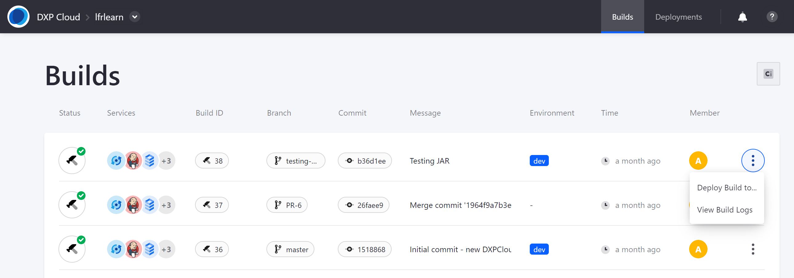
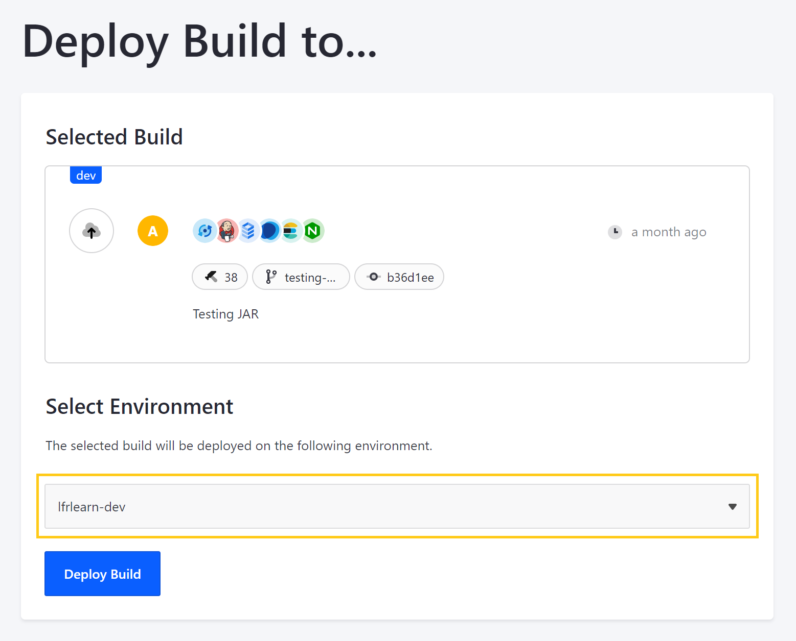
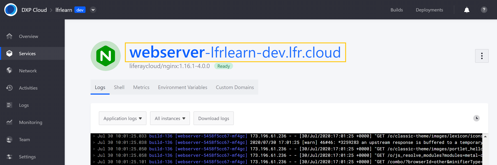

# Walking Through the Deployment Life Cycle

The following tutorial walks you through a common deployment workflow using the DXP Cloud console. This example includes the following steps: adding a sample JAR module to the Liferay service in your working repository, triggering a CI build with GitHub, and deploying your new build to your project's development (`dev`) environment.

See [Overview of the DXP Cloud Deployment Workflow](./overview-of-the-dxp-cloud-deployment-workflow.md) for more general information about the deployment process.

For an alternative deployment workflow, see [Deploying Services with the CLI Tool](./deploying-services-with-the-cli-tool.md) to learn how to deploy local changes to your project environments using the Liferay Cloud Platform CLI tool.

<!-- ```note::
   This tutorial uses the default ``dev`` name for the project's development environment. If your development environment is named differently, you can substitute ``dev`` with the correct name.
``` -->

* [Prerequisites](#prerequisites)
* [Adding the Sample Module to Your Working Repository](#adding-the-sample-module-to-your-working-repository)
* [Triggering a Jenkins Build with GitHub](#triggering-a-jenkins-build-with-github)
* [Deploying Your New Build via the DXP Cloud Console](#deploying-your-new-build-via-the-dxp-cloud-console)
* [Verifying Your Sample Deployment](#verifying-your-sample-deployment)

## Prerequisites

To get started, you need a code hosting service integrated with the CI service, a working copy of your project's repository, and a sample module compiled into a JAR.

* **Configured Git Repository**: Ensure your code hosting service is integrated with the CI service to trigger builds. This tutorial uses Github to trigger CI service builds with webhooks. See [Configuring Your GitHub Repository](../getting-started/configuring-your-github-repository.md) for instructions. If you are using an alternative code hosting service, see [Bitbucket](../getting-started/configuring-your-bitbucket-repository.md) or [GitLab](../getting-started/configuring-your-gitlab-repository.md) for configuration instructions.
* **Local Working Repository**: Create a local working copy of your project's central repository. With GitHub, this means creating a forked copy of your project's repository on GitHub and creating a clone of that forked repository on your local device. See [GitHub](https://docs.github.com/en/github/creating-cloning-and-archiving-repositories/cloning-a-repository-from-github), [Bitbucket](https://confluence.atlassian.com/bitbucketserver/clone-a-repository-790632786.html), or [GitLab](https://docs.gitlab.com/ee/university/training/topics/getting_started.html#instantiate-workflow-with-clone) for more information about setting up your local working repository.
* **Sample JAR Module**: Prepare a sample module compiled into a JAR to configure the Liferay DXP service. This tutorial uses the sample "JSP Portlet" module from the [Liferay Blade Samples](https://github.com/liferay/liferay-blade-samples) repository, but you can use any module of your choice. See [Configuring the Liferay DXP Service](../using-the-liferay-dxp-service/configuring-the-liferay-dxp-service.md) for more information about creating your own Liferay service customizations.

## Adding the Sample Module to Your Working Repository

The deployment life cycle begins with making and committing changes to your local working repository.

Follow these steps:

1. Run the following command from your local master branch to ensure it is up-to-date with your project's upstream repository.

   ```bash
   git pull upstream master
   ```

1. Create a new working branch based on your up-to-date master branch.

   ```bash
   git checkout -b testing-branch
   ```

1. Copy and add your sample JAR module to the `deploy` folder of your project's development environment using the following path: `liferay/configs/{ENV}/deploy/`.

   ```bash
   cp path-to-module/my-module my-repository-path/liferay/configs/dev/deploy
   ```

1. Add and commit the sample module to your repository with the following command.

   ```bash
   git commit -am "Testing JAR"
   ```

```note::
   If you are using version 3.x.x services, then the appropriate folder path is ``lcp/liferay/deploy/dev``. See `DXP Cloud Project Changes in Version 4 <#project-version-3-differences>`__ for more information on the differences in the directory structure, and `Understanding Service Stack Versions <../reference/understanding-service-stack-versions.md>`__ for how to check the version of your services.
```

## Triggering a Jenkins Build with GitHub

Next, follow these steps to push your new branch with the sample module to your GitHub repository origin and trigger a Jenkins build by creating a pull request:

1. Push your new branch to the origin of your local repository (i.e., your forked copy of your project's central repository).

   ```bash
   git push origin testing-branch
   ```

1. Navigate to your GitHub repository, and create a pull request for your new branch to the master branch of your project's central repository.

   

This will automatically trigger a Jenkins build with a unique *Build ID* that can be deployed to your project environments via the DXP Cloud console.

You can track the status of your build in real time via your GitHub pull request or your project's CI page (e.g., `https://ci-<project-name>-infra.lfr.cloud`).

You can also view build details via the DXP Cloud console. See [Team Activities](../manage-and-optimize/team-activities.md) and [Log Management](troubleshooting/log-management.md) for more information about tracking environment events.

## Deploying Your New Build via the DXP Cloud Console

Once your new build is ready, follow these steps to deploy it to your project's development environment via the DXP Cloud console:

1. Navigate to the *Builds* page for your project in the DXP Cloud console. You can access this page from any project environment.

1. Click on the *Actions* button ( ⋮ ) for the build you want to deploy, and select *Deploy Build To...* This action becomes available once the build succeeds.

   You can identify your new build by its branch, commit, and message details, which come from your pull request.

   

1. Select the `dev` environment, and click on *Deploy Build*.

   

   ```tip::
      You can also access the *Deploy Build to...* page by clicking on the *Build ID* for the build you want to deploy.
   ```

You can view the status of your deployment from the *Deployments* page, as well as the *Logs* and *Activities* pages of the `dev` environment.

## Verifying Your Sample Deployment

Once your build has deployed successfully and your services are *Ready*, verify your changes to the Liferay service in your project's `dev` environment.

Follow these steps:

1. Navigate to your `dev` environment.

1. Click on the *Webserver* service in the *Overview* or *Services* page.

1. Click on the webserver URL for your `dev` environment's Liferay DXP instance: `https://webserver-<project-name>-dev.lfr.cloud/`.

   

1. Sign in to your Liferay DXP instance.

   You can find login credentials in the *Environment Variables* tab of the CI service in your project's `infra` environment. Click to view the values for the `JENKINS_CUSTOMER_USER_NAME` and `JENKINS_CUSTOMER_PASSWORD` variables. See [Logging into Your DXP Cloud Services](../getting-started/logging-into-your-dxp-cloud-services.md) for more information.

   

1. Navigate to the *Control Panel* → *Configuration* → *Gogo Shell*.

1. Execute the following command in the *Gogo shell* to confirm your module was deployed.

   ```
   lb | grep "my.module.name"`
   ```

   The output will indicate whether the module is installed.

   

Once you have verified the module deployed successfully, you have completed this tutorial.

## Additional Information

* [Deploying Services with the CLI Tool](./deploying-services-with-the-cli-tool.md)
* [Configuring Your GitHub Repository](../getting-started/configuring-your-github-repository.md)
* [Overview of the DXP Cloud Development Workflow](./overview-of-the-dxp-cloud-deployment-workflow.md)
* [Starting Module Development](https://help.liferay.com/hc/en-us/articles/360017884192-Starting-Module-Development)
* [Understanding DXP Cloud Environments](../getting-started/understanding-dxp-cloud-environments.md)
