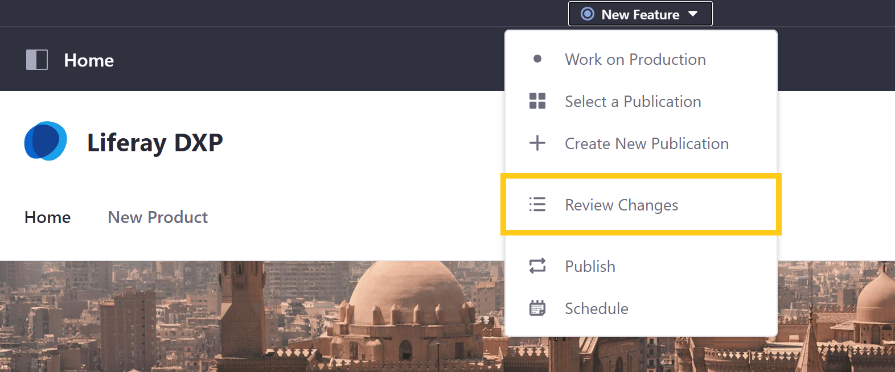
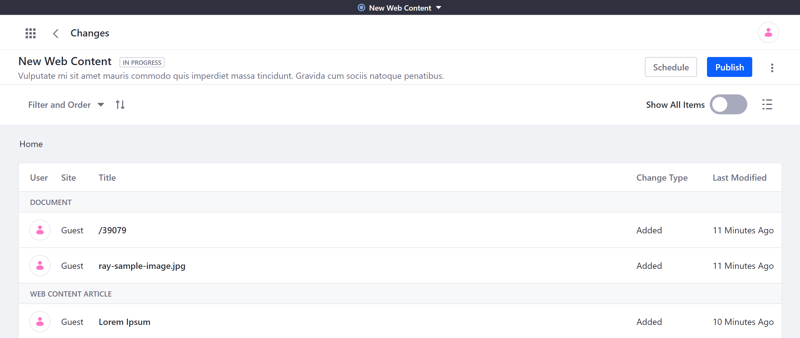
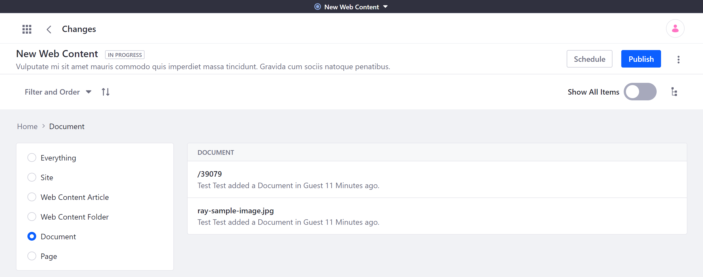

# Making and Publishing Changes

The Publications tool provides a convenient way to manage version publishing for your DXP instance. With it, your team can create multiple *publications* that group changes together into parallel blocks that can be published together when ready.

To enhance your publishing experience, learn how to make and publish changes to your instance using Publications.

* [Creating a Publication for Your Changes](#creating-a-publication-for-your-changes)
* [Making Changes on a Single Publication](#making-changes-on-a-single-publication)
* [Making Changes on Parallel Publications](#making-changes-on-parallel-publications)
* [Reviewing Publication Changes](#reviewing-publication-changes)
* [Publishing Your Changes](#publishing-your-changes)

## Creating a Publication for Your Changes

If you haven't already created a publication to track your changes, click on *Create New Publication* in the Publications bar drop-down menu.

This redirects you to the *Create New Publication* Page, where you can set the name and description for your new publication. See [Creating and Managing Publications](./creating-and-managing-publications.md) for more information.

## Making Changes on a Single Publication

Before making changes to your instance, ensure you're working on the correct publication and not on Production or a different publication. You can confirm this via the Publications bar, which displays the name of what you're currently working on.

If you're not working on the desired publication, click on *Select a Publication* and choose the correct one.  

If trackable, changes made to web content, documents, and Pages on your instance are added to your current publication's list of tracked changes. Since each publication is instance-scoped, your tracked changes can span multiple Sites. When editing different Sites in the same publication, keep in mind that all tracked changes are applied to Production when the publication is published.

With Publications, multiple Users can make changes to the same publication and publish their changes together. They can also work in parallel on different publications and publish their changes to Production separately.

### Adding and Editing Assets

When you add, edit, or remove assets in a publication, your changes are only visible via the publication in which they're made, and the publication's *Review Changes* page. They cannot be seen by Users in Production or another publication. Each application controls which parts of an asset are and are not trackable by publications.

### Displaying Assets

You can also edit how assets are displayed in widgets as part of your publication. Even widgets related to applications and content types that don't support Publications can be added to your publication as part of a Page.

### Deleting an Asset

When you delete an asset in a publication, DXP creates a new, special version of that asset with the *deleted* status. The asset remains viewable to Production and any other publications, since its removal in a publication is only a logical deletion.

## Making Changes on Parallel Publications

When two publications are created on the same baseline, they become parallel publications. Users can make changes in these parallel publications to create alternative edit histories of your instance entities. These changes can be compatible or conflicting, depending on whether they're editing the same or related content.

### Compatible Changes

If parallel publications include compatible changes, they can be published without issue. In this case, the tracked changes of both publications are applied to Production.

### Conflicting Changes

If parallel publications include incompatible changes, they cause a changes conflict during the publishing process. In this case, the User attempting to publish these conflicting changes is notified of the conflict. This notification also includes information about the cause of the conflict as well as whether DXP has automatically resolved the conflict, or if the conflict requires manual resolution. See [Resolving Conflicts](./resolving-conflicts.md) for more information about this process.

## Reviewing Publication Changes

Before Publishing, review your publication's tracked changes. You can do this by selecting *Review Changes* in the Publications bar drop-down menu.

Alternatively, you can review any publication's tracked changes in the *Ongoing* tab of the Publications overview Page. Simply click on the *Actions* button (  ) for the Publication you want to review, and select *Review Changes* to see all changes included in the selected publication.

### Simple and Advanced Change Summaries

By default, DXP displays a simple summary of the publication's tracked changes, but you can set the toggle switch to *Show all Items* to view all processes related to your changes.

Click on an individual change to see further details, including all processes connected to the change if *Show All Items* is enabled. You can click on the *Actions* button (  ) for the tracked change to either *Edit* or *Discard* it.

### Display Styles

Here, you can also switch between two display styles: *Changes* and *Context*.

* **Changes**: *Changes* displays all tracked changes in a list that you can order by *Change Type*, *Modified Date*, *Site*, *Title*, or *User*.

    

* **Context**: *Context* displays all changes in a tree, where each change can be seen in its relative context.

    

## Publishing Your Changes

When you're finished making your changes, you can publish them immediately, or schedule them to be published at a later time. Once published, a publication cannot be edited, and no further changes can be added to it. This is to help maintain a clear audit trail and to be able to roll back only the latest changes when needed.

However, you can easily *revert* a publication via the *History* tab of the Publications Page. From here, you can review changes included in a publication and create a new publication that already contains changes that undo those made by your selected publication. See [Reverting Changes](./reverting-changes.md) for more information.

### Publishing Now

To publish your changes immediately, ensure you're on the publication you want to publish to Production. Then, click on *Publish* in the *Publications* bar drop-down menu.

Alternatively, you can publish a publication by going to its *Changes* page and clicking on *Publish*.

DXP performs a conflict detection to see if there are any conflicting changes. If there are any conflicts detected, DXP notifies you of all automatically resolved conflicts and whether any conflicts require manual resolution. You cannot move forward with publishing until all conflicts are resolved. See [Resolving Conflicts](./resolving-conflicts.md) for more information about this process.

Once all conflicts are resolved, you can click on *Publish* to make your changes live on Production. Clicking on *Publish* also redirects you to the *History* tab of the Publications page, where you can see publication details, including its date, publisher, and status. Here, you can also revert changes. See [Reverting Changes](./reverting-changes.md) for more information.

### Scheduling for Later

To publish your changes at a later time, ensure you're on the publication you want to publish to Production. Then, click on *Schedule* in the *Publications* bar drop-down menu.

Alternatively, you can publish a publication by going to its *Changes* page and clicking on *Schedule*.

DXP performs a preliminary conflict detection to see if there are any existing conflicts. If there are no conflicts, or all conflicts have been resolved, you are directed to set a date and time for publishing your changes.

At the time of the publication, DXP will perform a second conflict detection to ensure there are no new conflicting changes. The publish fails if DXP detects new conflicts that cannot be automatically resolved. If the conflicts can be resolved automatically, DXP proceeds with publishing.

## Additional Information

* [Publications Overview](./publications-overview.md)
* [Enabling Publications](./enabling-publications.md)
* [Creating and Managing Publications](./creating-and-managing-publications.md)
