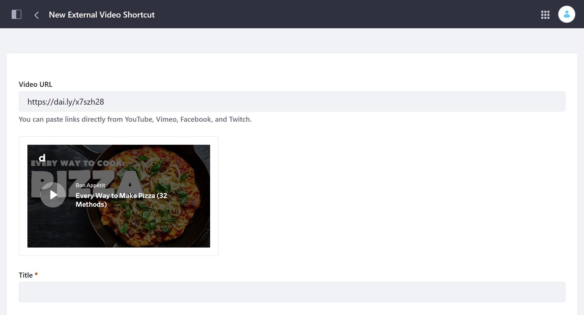

# Creating Custom Video Shortcut Providers

* Available for Liferay DXP 7.4+

By default, Liferay's external video shortcuts support [YouTube](https://github.com/liferay/liferay-portal/blob/master/modules/apps/document-library/document-library-video/src/main/java/com/liferay/document/library/video/internal/video/external/shortcut/provider/YouTubeDLVideoExternalShortcutProvider.java), [Vimeo](https://github.com/liferay/liferay-portal/blob/master/modules/apps/document-library/document-library-video/src/main/java/com/liferay/document/library/video/internal/video/external/shortcut/provider/VimeoDLVideoExternalShortcutProvider.java), [Facebook](https://github.com/liferay/liferay-portal/blob/master/modules/apps/document-library/document-library-video/src/main/java/com/liferay/document/library/video/internal/video/external/shortcut/provider/FacebookDLVideoExternalShortcutProvider.java), and [Twitch](https://github.com/liferay/liferay-portal/blob/master/modules/apps/document-library/document-library-video/src/main/java/com/liferay/document/library/video/internal/video/external/shortcut/provider/TwitchDLVideoExternalShortcutProvider.java). However, you can extend this feature to support custom video sources.

Follow these steps to create your own video shortcut provider:

1. **OSGI Component Annotation**: Use the `@Component` annotation to declare the provider a `DLVideoExternalShortcutProvider.class` service within the OSGi framework.

1. [**`DLVideoExternalShortcutProvider`**](https://github.com/liferay/liferay-portal/blob/master/modules/apps/document-library/document-library-api/src/main/java/com/liferay/document/library/video/external/shortcut/provider/DLVideoExternalShortcutProvider.java): Implement the `DLVideoExternalShortcutProvider` interface.

1. **Override the Interface's Method**: Override the interface's `getDLVideoExternalShortcut()` method. This method creates an instance of the [`DLVideoExternalShortcut`](https://github.com/liferay/liferay-portal/blob/master/modules/apps/document-library/document-library-api/src/main/java/com/liferay/document/library/video/external/shortcut/DLVideoExternalShortcut.java) interface and receives a URL String from the user. Ensure your implementation also has the following functionalities.

   * Check whether the received URL matches any defined URL patterns.
   * If the URL does not match any patterns, the program should return `null`. Liferay will then call any other available providers in search of a match.
   * If the URL matches one of the provider's defined patterns, the program should parse the URL, fetch any extra information from the external source, and return a `DLVideoExternalShortcut` instance with the gathered information.

1. **Override `DLVideoExternalShortcut` Methods**: Override the following methods for the `DLVideoExternalShortcut` instance returned by the `getDLVideoExternalShortcut()` method.

   * (Optional) `getDescription()`: Use this method to retrieve the original video's description; its default value is `null`.
   * (Optional) `getThumbnailURL()`: Use the this method to retrieve the video's thumbnail; its default value is `null`.
   * (Optional) `getTitle()`: Use this method to retrieve the original video's title; its default value is `null`.
   * (Required) `getURL()`: Use this method to retrieve the original video URL.
   * (Required) `renderHTML()`: Use this method to embed the video in the user interface. This will typically render an iframe but it can also render an HTML video tag or whatever is needed in order for the video to be played by users.

The following tutorial uses a [sample external video shortcut provider](https://learn.liferay.com/docs/dxp/latest/en/content-authoring-and-management/documents-and-media/developer-guide/liferay-g9b6.zip) to demonstrate the minimum requirements for implementing your own. See [existing providers](https://github.com/liferay/liferay-portal/tree/master/modules/apps/document-library/document-library-video/src/main/java/com/liferay/document/library/video/internal/video/external/shortcut/provider) for more complex examples.

## Deploying the Sample Video Provider

Follow these steps to download, build, and deploy the sample custom video shortcut provider to a new docker container:

1. Start a new [Liferay Docker container](../../installation-and-upgrades/installing-liferay/using-liferay-docker-images/docker-container-basics.md).

   ```bash
   docker run -it -p 8080:8080 [$LIFERAY_LEARN_DXP_DOCKER_IMAGE$]
   ```

1. Download and unzip the example module.

   ```bash
   curl https://learn.liferay.com/docs/dxp/latest/en/content-authoring-and-management/documents-and-media/developer-guide/liferay-g9b6.zip -O
   ```

   ```bash
   unzip liferay-g9b6.zip -d liferay-g9b6
   ```

1. Run the `gradlew deploy` command to build the JAR file and deploy it to your new Docker container:

   ```bash
   ./gradlew deploy -Ddeploy.docker.container.id=$(docker ps -lq)
   ```

   The JAR is generated in the `build/libs` folder (i.e., `g9b6-impl/build/libs/com.acme.G9B6.impl-1.0.0`).

1. Confirm the provider was successfully deployed and started via the container console.

   ```log
   Processing com.acme.G9B6.impl-1.0.0.jar
   STARTED com.acme.G9B6.impl-1.0.0 [1356]
   ```

1. Verify the module is working by creating a new external video shortcut<!--TASK: add link once article is merged--> with a short Dailymotion URL (e.g., https://dai.ly/x7szh28).

   If successful, Liferay should recognize Dailymotion as a supported platform.

   

## Code for the Sample Video Provider

```literalinclude:: ./creating-custom-video-shortcut-providers/resources/liferay-g9b6.zip/g9b6-impl/src/main/java/com/acme/g9b6/internal/document/library/video/external/shortcut/provider/G9B6DLVideoExternalShortcutProvider.java
   :dedent: 1
   :language: java
   :lines: 14-51
```

### OSGi Component Annotation

The provider is declared a component within the OSGi framework and identified as a `DLVideoExternalShortcutProvider.class` service.

### `DLVideoExternalShortcutProvider` Implementation

The provider implements the `DLVideoExternalShortcutProvider` interface. This interface includes a single method, `getDLVideoExternalShortcut`, which returns a `DLVideoExternalShortcut` if a valid URL is received.

### Override `getDLVideoExternalShortcut`

The provider overrides the interface's `getDLVideoExternalShortcut` method, which contains all of the provider's essential logic. First, it receives a URL from the user, and then checks whether it matches the defined regex pattern. If no match is found, then it returns `null`, and Liferay proceeds to call other available providers in search of a match. However, if it does match, then it returns a new `DLVideoExternalShortcut` object for embedding the video into the Liferay Page or asset.

### Overrides `DLVideoExternalShortcut`'s Methods

When the provider returns a `DLVideoExternalShortcut` object, it overrides the object's `getURL()` and `renderHTML()` methods. First, `getURL()` returns the URL entered by the user. Then, `renderHTML()` receives a `HttpServletRequest` parameter and returns an `iframe` string that's used with a `div` expression to embed the video into a Liferay Page or asset. Consider the following example.

```html
<div class="embed-responsive embed-responsive-16by9" data-embed-id="https://www.dailymotion.com/embed/video/x7szh28" data-styles="{&quot;width&quot;:&quot;59%&quot;}" style="width:59%"><iframe allow="autoplay; encrypted-media" allowfullscreen="" frameborder="0" height="315" src="https://www.dailymotion.com/embed/video/x7szh28" width="560"></iframe></div>
```

By not overriding the `getDescription()`, `getThumbnailURL()`, and `getTitle()` methods, it uses their default `null` values.
