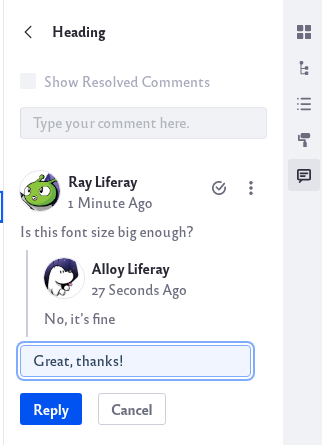
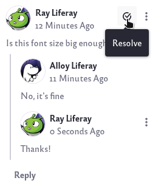
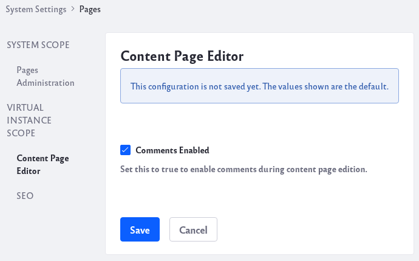

# Using Fragment Comments

As you and your team use Fragments to create new pages, you can use the Fragment Comments tool for collaboration. Fragment Comments are enabled out-of-the-box in Liferay DXP 7.3, but they are disabled by default in Liferay DXP 7.2. See [enabling Fragment Comments](#enabling-fragment-comments) to learn more.

## Using Fragment Comments

To start using Fragment Comments,

1. Navigate to the Asset that contains the fragment where you want to add a comment.

1. Click the *Edit* icon () at the top of the page.

1. Use your cursor to select the fragment where you want to add a comment.

   

1. Click the _Comments_ icon () in the right sidebar.

1. You can add comments to a specific Fragment. Other users can also reply to your comments.

   

   Write a comment and click on the *Comment* button. To reply to a comment, simply type your reply and click on the *Reply* button.

1. If someone answered a question or resolved an issue, click the *Resolve* icon. 

   

   Clicking the *Resolve* icon hides the comment and any replies to the comment. To display previously resolved comments, check the *Show Resolved Comments* checkbox.

   

1. Clicking the *Options* icon () reveals edit or delete options. To edit, click *Edit*, make your changes, and click *Update*. To delete a comment, click *Delete*.

## Enabling Fragment Comments

To enable comments for Fragments, follow these steps:

1. Go to the Control Panel and navigate to *Configuration* &rarr; *System Settings* &rarr; *Content and Data* &rarr; *Pages*.

1. Select *Content Page Editor* under the Virtual Instance Scope. Check the *Comments Enabled* checkbox and click the *Save* button.

   

   You should now be able to use Fragment Comments.

   Note that this affects content page comments for all instances. To control this on an instance-by-instance basis, navigate to the same setting in *Instance Settings* (instead of *System Settings*).

## Additional Information

- [Using Page Fragments](./using-page-fragments.md)
- [Managing Page Fragments](./managing-page-fragments.md)
- [Propagating Page Fragment Changes](./propagating-page-fragment-changes.md)
