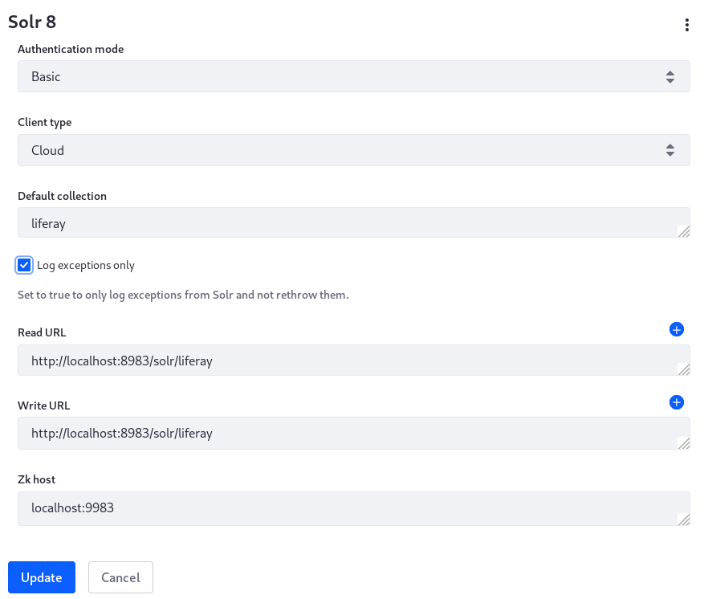
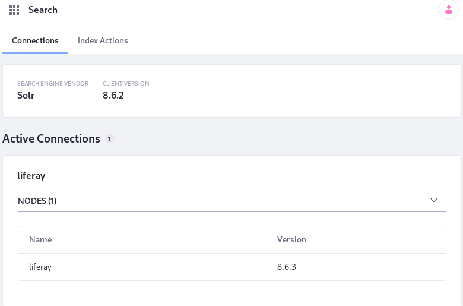

# Installing Solr 

These instructions describe installing Solr 8 for Liferay 7.3. They apply equally to installing Solr 7 for Liferay 7.2, but some adjustments for version name may be necessary.

```important::
   -  Liferay's Solr support is deprecated; Solr 8 is the last supported Solr version. Please plan to migrate to `Elasticsearch <../elasticsearch/getting-started-with-elasticsearch.md>`_.

   -  There are important limitations to be aware of when installing Solr. Read `Solr Limitations <./solr-limitations.md>`__ before proceeding with the installation.
```

Solr is a popular enterprise search platform built on Apache Lucene. It's reliable, scalable, and fault tolerant. Read more about it [here](http://lucene.apache.org/solr/).

See the [Search Engine Compatibility Matrix](https://help.liferay.com/hc/en-us/articles/360016511651) for  more detailed information on Liferay's search engine support.

As you proceed, remember these terms: 

*Solr Home*: Refers to `solr-[version]/server/solr/`, the main Solr configuration directory. This is where the Liferay core will be configured.

*Liferay Home*: The root folder of your Liferay installation. It contains the `osgi`, `deploy`, `data`, and `license` folders, among others.

## Disabling Elasticsearch-Only Features

Before installing the Liferay Connector to Solr, you must blacklist or otherwise disable

- the modules for certain DXP features that only work with Elasticsearch
- the Liferay Connector to Elasticsearch's modules

```tip::
   Use the Gogo shell command ``lb [substring-to-search] -s`` to search for modules deployed to the OSGi runtime and list them by their Symbolic Name. The Symbolic Name is the value to enter in the ``blacklistBundleSymbolicNames`` property.

   The following command returns the list of modules that must be blacklisted:

   ``lb -s | grep 'search' | grep 'elasticsearch|tuning'``
```

### Blacklisting Elasticsearch-Only Features

If you're a Liferay DXP customer you should use the blacklist feature to disable the Elasticsearch-only features. CE users can also use this approach:

1. Create a configuration file named

   ```bash
   com.liferay.portal.bundle.blacklist.internal.BundleBlacklistConfiguration.config
   ```

1. Give it these contents:

   ```properties
   blacklistBundleSymbolicNames=["com.liferay.portal.search.elasticsearch7.api","com.liferay.portal.search.elasticsearch7.impl","com.liferay.portal.search.elasticsearch7.spi","com.liferay.portal.search.tuning.rankings.web","com.liferay.portal.search.tuning.synonyms.web","com.liferay.portal.search.tuning.web","com.liferay.portal.search.tuning.web.api"]
   ```

1. Place the file in `Liferay Home/osgi/configs`. 

   Here's the complete list of apps and bundles you're disabling:

   - `com.liferay.portal.search.elasticsearch7.api`
   - `com.liferay.portal.search.elasticsearch7.impl`
   - `com.liferay.portal.search.elasticsearch7.spi`
   - `com.liferay.portal.search.tuning.web.api`
   - `com.liferay.portal.search.tuning.web`
   - `com.liferay.portal.search.tuning.rankings.web`
   - `com.liferay.portal.search.tuning.synonyms.web`

### Stopping the Modules with Elasticsearch-Only Features

The App Manager and Gogo shell rely on the `osgi/state` folder to "remember" the state of the bundle. If you delete this folder (recommended during [patching Liferay DXP](../../../installation-and-upgrades/maintaining-a-liferay-dxp-installation/patching-liferay/patching-liferay.md)) the Elasticsearch connector is reinstalled and started automatically. Liferay CE users can use the blacklist approach or disable the Elasticsearch and search tuning modules in the App Manager or the Gogo shell. 

To disable via App Manager,

1. Navigate to Control Panel &rarr; Apps &rarr; App Manager.

1. Once in the App Manager, search for *elasticsearch*. Find the Liferay Connector to Elasticsearch 7 modules and open the Actions () menu. Choose _Deactivate_.  This leaves the bundle installed, but stops it in the OSGi runtime. Do the same for the search tuning modules.

To use the [Felix Gogo shell](../../../liferay-internals/fundamentals/using-the-gogo-shell/using-the-gogo-shell.md) to stop the Elasticsearch and search tuning modules,

1. Enter `lb -s | grep 'search' | grep 'elasticsearch|tuning'`

   You'll see several active bundles for the connector to Elasticsearch and the search tuning modules.

1. For each bundle listed enter `stop [bundle ID]`.

## Installing and Configuring Solr

**Before proceeding, stop the Liferay instance.**

To install and properly configure Solr for Liferay:

1. Download a [compatible](https://help.liferay.com/hc/en-us/articles/360016511651) Solr and unzip it. The below links are for convenience only and represent the latest compatible Solr version at the time of writing. See the [Search Engine Compatibility Matrix](https://help.liferay.com/hc/en-us/articles/360016511651) to see if newer compatible versions are available.
   - Liferay 7.3: [Solr 8.6.3](https://archive.apache.org/dist/lucene/solr/8.6.3/)) 
   - Liferay 7.2: [Solr 7.5.0](http://archive.apache.org/dist/lucene/solr/7.5.0/)

1. Navigate to Solr Home (`solr-[version]/server/solr`) and create a new folder called `liferay`.

1. Create two new subfolders: `liferay/conf` and `liferay/data`.

1. Copy the contents of `Solr_Home/configsets/_default/conf` to `Solr_Home/liferay/conf`.

1. Open the Liferay Connector to Solr 8's LPKG file with an archive manager.

   Next open the `Liferay Connector to Solr 8 - Impl.lpkg`.

   Finally, open the `com.liferay.portal.search.solr8.impl.jar` file, and extract 

   ```
   META-INF/resources/solrconfig.xml
   ```

   and

   ```
   META-INF/resources/schema.xml
   ```

   to

   ```
   Solr_Home/liferay/conf
   ```

   This replaces the current `solrconfig.xml` and `schema.xml` files with ones that tell Solr how to index data coming from Liferay.

1. Create a `core.properties` file in `Solr_Home/liferay` and add this configuration:

   ```properties
   config=solrconfig.xml
   dataDir=data
   name=liferay
   schema=schema.xml
   ```

1. Checkpoint: your `Solr_Home/liferay` folder now has this structure:

   ```bash
   liferay
   ├── conf
   │   ├── lang
   │   │   ├── contractions_ca.txt
   │   │   ├── ....txt
   │   ├── managed-schema
   │   ├── protwords.txt
   │   ├── schema.xml
   │   ├── solrconfig.xml
   │   ├── stopwords.txt
   │   └── synonyms.txt
   ├── core.properties
   └── data
   ```

1. Start the Solr server by entering the following from the top-level folder of your Solr installation (`solr-[version]`):

   ```bash
   ./bin/solr start -f
   ```

1. The Solr server listens on port `8983` by default. Navigate to <http://localhost:8983/solr/#/~cores> (assuming you're testing locally with `localhost` as your host), and confirm that the `liferay` core is available.

Solr is now installed and started. Next configure and install the Solr connector for Liferay.

## Installing the Solr Connector

To install the Liferay Connector to Solr [7 or 8], navigate to [Liferay Marketplace](https://web.liferay.com/marketplace/) and download the app version that corresponds to your Liferay version.

   - **Liferay CE:** [Liferay CE Connector to Solr 8](https://web.liferay.com/marketplace/-/mp/application/181462322) 

   - **Liferay DXP:** [Liferay Connector to Solr 8](https://web.liferay.com/marketplace/-/mp/application/181462183)

The default connector configuration works for a test installation because the default configurations in the Liferay Connector to Solr match Solr's own defaults. See the [Configuration Reference](#solr-connector-configuration-reference) for the complete list of available settings. At a minimum, the read and write URLs must be configured for the connector in production environments.

In production deployments it's most common to make your edits to the Solr connector's default configurations using a configuration file deployed to the `Liferay_Home/osgi/configs` folder: 

1. Name the file 

```
com.liferay.portal.search.solr8.configuration.SolrConfiguration.config
```

   You can alternatively use the UI for configuring the connector. Find the Solr 7 System Settings entry in Control Panel &rarr; Configuration &rarr; System Settings.

   

1. Once the app LPKG is downloaded, copy it to `Liferay_Home/osgi/marketplace` and put any configuration files in `Liferay_Home/osgi/configs`.

1. Start Liferay.

1. Re-index your Liferay data into Solr. Open the Global Menu and navigate to *Control Panel* &rarr; *Configuration* &rarr; *Search*. In the Index Actions pane, click *Execute* next to the *Reindex all search indexes* option.

   Re-index the spell check indexes too.

   

## High Availability with SolrCloud

Use SolrCloud if you need a cluster of Solr servers. Note that to use SolrCloud in production, you should set up an [external ZooKeeper ensemble](https://cwiki.apache.org/confluence/display/solr/Setting+Up+an+External+ZooKeeper+Ensemble). [ZooKeeper](http://zookeeper.apache.org/) is a centralized coordination service for managing distributed systems like your SolrCloud cluster.

The steps included here should be considered the bare minimum of what must be done to configure SolrCloud with Liferay. For example, these instructions cover configuring SolrCloud on a single machine, whereas a production environment would feature multiple physical or virtual machines. These instructions also assume you've followed the earlier section on *Installing and Configuring Solr*. Refer to the [SolrCloud guide for more information](https://cwiki.apache.org/confluence/display/solr/SolrCloud).

1. Stop the Solr server if it's running.

1. Navigate to the `Solr_Home/configsets` folder and create a folder called 

   `liferay_configs`

1. Copy the `conf` folder from `Solr_Home/liferay` to the `liferay_configs` folder you just created.

   The `configset/liferay_configs` folder contains the SolrCloud Liferay collection configuration and is uploaded to ZooKeeper. When you copy the `conf` folder from the `liferay` server configured earlier, you use the `schema.xml` and `solrconfig.xml` files provided with the Liferay Solr Adapter.

1. Launch an interactive SolrCloud session to configure your SolrCloud cluster: 

   ```bash
   ./bin/solr -e cloud
   ```

1. Complete the setup wizard. These steps demonstrate creating a two-node cluster:

    -  Enter `2` for the number of nodes.
    -  Specify ports `8983` and `7574` (the defaults). Both nodes are started with the start commands printed in the log:

       ```
       Starting up Solr on port 8983 using command:
       "bin/solr" start -cloud -p 8983 -s "example/cloud/node1/solr"

       Waiting up to 180 seconds to see Solr running on port 8983 [|]  [-]  
       Started Solr server on port 8983 (pid=8846). Happy searching!

           
       Starting up Solr on port 7574 using command:
       "bin/solr" start -cloud -p 7574 -s "example/cloud/node2/solr" -z localhost:9983

       Waiting up to 180 seconds to see Solr running on port 7574 [|]  [/]  
       Started Solr server on port 7574 (pid=9026). Happy searching!
       ```

    -  Name the collection *liferay*.
    -  Split the collection into two shards.
    -  Specify two replicas per shard.
    -  When prompted to choose a configuration, enter *liferay_configs*. You should see a log message that concludes like this when the cluster has been started:

    ```bash
    SolrCloud example running, please visit http://localhost:8983/solr
    ```

Now you have a new collection called *liferay* in your local SolrCloud cluster.  Verify its status by running the *status* command:

```bash
./bin/solr status
```

The log output states that the nodes are found and lists information for each node:

```
Found 2 Solr nodes: 

Solr process 223597 running on port 8983
{
  "solr_home":"/home/user/liferay-bundles/solr8_7.3/solr-8.6.3/example/cloud/node1/solr",
  "version":"8.6.3 e001c2221812a0ba9e9378855040ce72f93eced4 - jasongerlowski - 2020-10-03 18:12:03",
  "startTime":"2021-03-23T18:26:45.450Z",
  "uptime":"0 days, 0 hours, 25 minutes, 4 seconds",
  "memory":"306.5 MB (%59.9) of 512 MB",
  "cloud":{
    "ZooKeeper":"localhost:9983",
    "liveNodes":"2",
    "collections":"1"}}
...
```

To stop Solr while running in SolrCloud mode, use the *stop* command, like this:

```bash
./bin/solr stop -all
```

## Configure the Solr Adapter for SolrCloud

There's only one thing left to do: specify the client type as *CLOUD* in Liferay's Solr connector.

1. From System Settings or your OSGi configuration file, set the *Client Type* to *CLOUD*.

   ```properties
   clientType="CLOUD"
   ```

1. Start Liferay if it's not running already. If this is the first time starting after installing the Solr connector LPKG, follow the instructions in the log to restart Liferay again.


## Solr Connector Configuration Reference

Below are the default configurations along with settings that become available (in the System Settings Search category, or configurable by `.config` file) when you install the Solr connector application. These settings accept a limited set of values: 

**Configuration File:** `com.liferay.portal.search.solr8.configuration.SolrConfiguration.config` \
**System Settings Entry:** _Solr 8_
```properties
authenticationMode=["BASIC" or "CERT"]
clientType=["REPLICATED" or "CLOUD"]
defaultCollection="liferay"
logExceptionsOnly=B"true"
readURL="http://localhost:8983/solr/liferay"
writeURL="http://localhost:8983/solr/liferay"
zkHost="localhost:9983"
```

**Configuration File:** `com.liferay.portal.search.solr8.configuration.SolrHttpClientFactoryConfiguration.config` \
**System Settings Entry:** _Solr 8 HTTP Client Factory_

```properties
basicAuthPassword="solr"
basicAuthUserName="solr"
defaultMaxConnectionsPerRoute="20"
maxTotalConnections="20"
```

**Configuration File:** `com.liferay.portal.search.solr8.configuration.SolrSSLSocketFactoryConfiguration.config` \
**System Settings Entry:** _Solr 8 SSL Factory_

```properties
keyStorePassword="secret"
keyStorePath="classpath:/keystore.jks"
keyStoreType="JKS"
trustStorePassword="secret"
trustStorePath="classpath:/truststore.jks"
trustStoreType="JKS"
verifyServerCertificate=B"true"
verifyServerName=B"true"
```

Now you can configure Liferay for Solr and Solr for Liferay. Remember that Solr is [deprecated](../../../installation-and-upgrades/upgrading-liferay/reference/maintenance-mode-and-deprecations-in-7-3.md). If you're not constrained to use Solr or already a Solr expert, use Elasticsearch.
